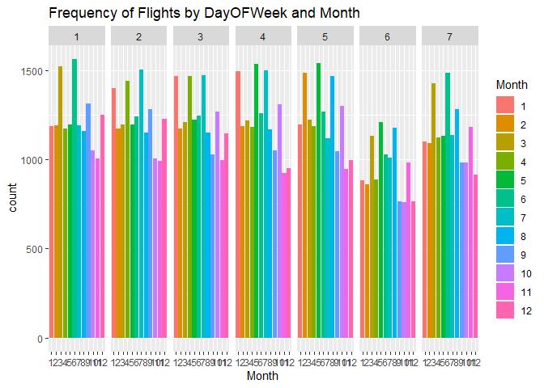
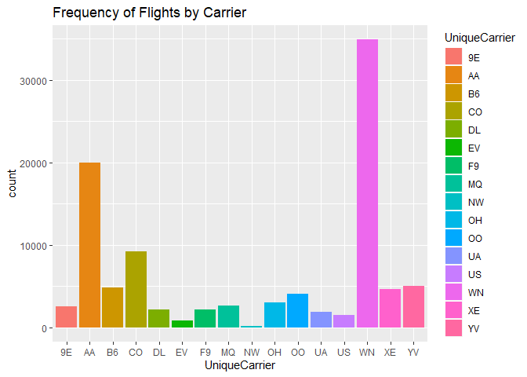
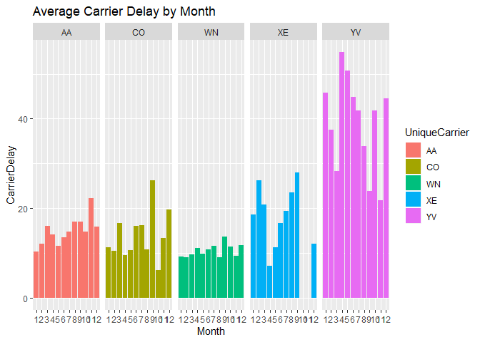
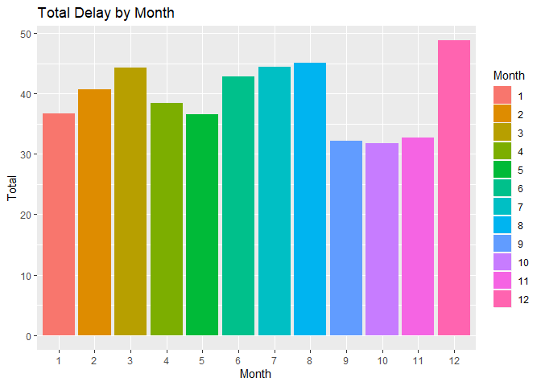
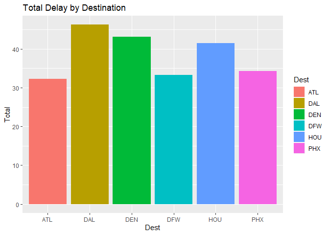
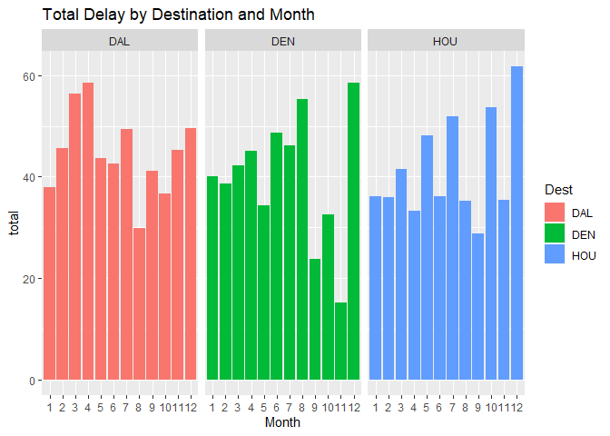
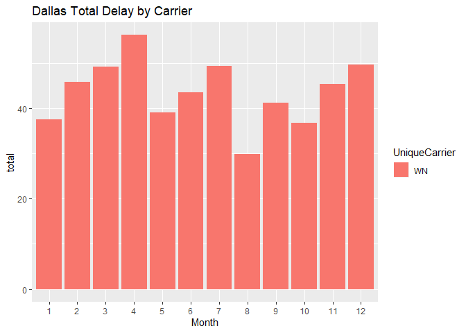
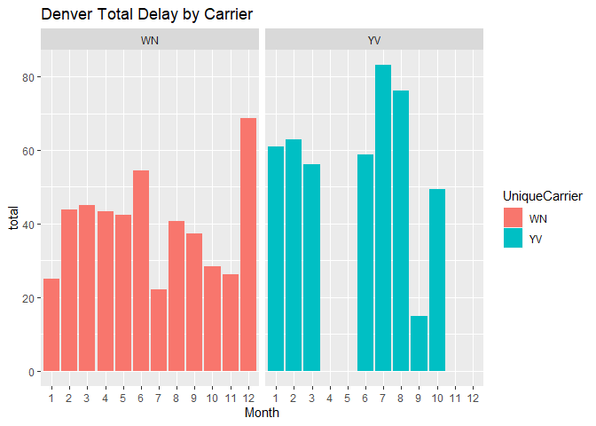
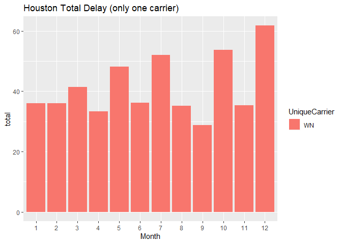

``` r
library(ggplot2)
library(dplyr)
```

    ## 
    ## Attaching package: 'dplyr'

    ## The following objects are masked from 'package:stats':
    ## 
    ##     filter, lag

    ## The following objects are masked from 'package:base':
    ## 
    ##     intersect, setdiff, setequal, union

``` r
library(tidyr)
library(readr)
library(knitr)
data <- read_csv("C:/Users/19785/Documents/MSBA/Predictive Modeling/data/ABIA.csv")
```

    ## Parsed with column specification:
    ## cols(
    ##   .default = col_double(),
    ##   UniqueCarrier = col_character(),
    ##   TailNum = col_character(),
    ##   Origin = col_character(),
    ##   Dest = col_character(),
    ##   CancellationCode = col_character()
    ## )

    ## See spec(...) for full column specifications.

### Saturdays have the least amount of flights.

``` r
data$Month <- as.factor(data$Month)
ggplot(data, aes(x=Month, fill=Month))+geom_bar() + facet_grid(~DayOfWeek) + ggtitle('Frequency of Flights by DayOFWeek and Month')
```


\#\#\# WN has the most flights

``` r
ggplot(data, aes(x=UniqueCarrier, fill=UniqueCarrier))+geom_bar() + ggtitle('Frequency of Flights by Carrier')
```



### YV has the longest carrier delays

``` r
carrier_list = c('AA', 'WN', 'CO', 'XE', 'YV')


stuff1 = data %>%
  filter(UniqueCarrier %in% carrier_list) %>%
  group_by(Month, UniqueCarrier) %>%
  summarize(CarrierDelay = mean(CarrierDelay, na.rm=TRUE))

ggplot(stuff1) + 
  geom_bar(aes(x=Month, y=CarrierDelay, fill=UniqueCarrier), stat='identity') + facet_grid(~UniqueCarrier) + ggtitle('Average Carrier Delay by Month')
```


\#\#\# December is the worst month to travel, expect delays!

``` r
aved1 = data %>%
  group_by(Month) %>%
  summarize(CarrierDelay = mean(CarrierDelay, na.rm=TRUE),
            WeatherDelay = mean(WeatherDelay, na.rm=TRUE),
            SecurityDelay = mean(SecurityDelay, na.rm=TRUE),
            LateAircraftDelay = mean(LateAircraftDelay, na.rm=TRUE),
            Total = CarrierDelay + WeatherDelay + SecurityDelay + LateAircraftDelay)


ggplot(aved1) + 
  geom_bar(aes(x=Month, y=Total, fill=Month), stat='identity') + ggtitle('Total Delay by Month')
```



### Dallas, Denver and Houston are the worst airports to travel to.

``` r
#sort(table(data$Dest), decreasing = TRUE)


dest_list = c('DAL', 'DFW', 'PHX', 'DEN', 'HOU', 'ATL')

dest_stuff = data %>%
  filter(Dest %in% dest_list) %>%
  group_by(Dest) %>%
  summarize(CarrierDelay = mean(CarrierDelay, na.rm=TRUE),
            WeatherDelay = mean(WeatherDelay, na.rm=TRUE),
            SecurityDelay = mean(SecurityDelay, na.rm=TRUE),
            LateAircraftDelay = mean(LateAircraftDelay, na.rm=TRUE),
            Total = CarrierDelay + WeatherDelay + SecurityDelay + LateAircraftDelay)


ggplot(dest_stuff) + 
  geom_bar(aes(x=Dest, y=Total, fill=Dest), stat='identity') + ggtitle('Total Delay by Destination')
```



### The worst month to travel to Dallas is April, the worst month to travel to Denver is December and the worst month to travel to Houston is also December

``` r
dest_list2 = c('DAL', 'DEN', 'HOU')

dest_stuff2 = data %>%
  filter(Dest %in% dest_list2) %>%
  group_by(Dest, Month) %>%
  summarize(CarrierDelay = mean(CarrierDelay, na.rm=TRUE),
            WeatherDelay = mean(WeatherDelay, na.rm=TRUE),
            SecurityDelay = mean(SecurityDelay, na.rm=TRUE),
            LateAircraftDelay = mean(LateAircraftDelay, na.rm=TRUE),
            total = CarrierDelay + WeatherDelay + SecurityDelay + LateAircraftDelay)

ggplot(dest_stuff2) + 
  geom_bar(aes(x=Month, y=total, fill=Dest), stat='identity') + ggtitle('Total Delay by Destination and Month') + facet_grid(~Dest)
```



### Out of our 5 most frequent air carriers, only WN travels to Dallas and April is the worst Month

``` r
dallas = c('DAL')
carrier_list = c('AA', 'WN', 'CO', 'XE', 'YV')

dest_stuff3 = data %>%
  filter(Dest %in% dallas) %>%
  filter(UniqueCarrier %in% carrier_list) %>%
  group_by(Dest, Month, UniqueCarrier) %>%
  summarize(CarrierDelay = mean(CarrierDelay, na.rm=TRUE),
            WeatherDelay = mean(WeatherDelay, na.rm=TRUE),
            SecurityDelay = mean(SecurityDelay, na.rm=TRUE),
            LateAircraftDelay = mean(LateAircraftDelay, na.rm=TRUE),
            total = CarrierDelay + WeatherDelay + SecurityDelay + LateAircraftDelay)


ggplot(dest_stuff3) + 
  geom_bar(aes(x=Month, y=total, fill=UniqueCarrier), stat='identity') + ggtitle('Dallas Total Delay by Carrier')
```



### It looks like YV only travels to Denver 8 Months out of the year and the worst month to travel with them is July

``` r
denver = c('DEN')

dest_stuff4 = data %>%
  filter(Dest %in% denver) %>%
  filter(UniqueCarrier %in% carrier_list) %>%
  group_by(Dest, Month, UniqueCarrier) %>%
  summarize(CarrierDelay = mean(CarrierDelay, na.rm=TRUE),
            WeatherDelay = mean(WeatherDelay, na.rm=TRUE),
            SecurityDelay = mean(SecurityDelay, na.rm=TRUE),
            LateAircraftDelay = mean(LateAircraftDelay, na.rm=TRUE),
            total = CarrierDelay + WeatherDelay + SecurityDelay + LateAircraftDelay)


ggplot(dest_stuff4) + 
  geom_bar(aes(x=Month, y=total, fill=UniqueCarrier), stat='identity') + ggtitle('Denver Total Delay by Carrier') + facet_grid(~ UniqueCarrier)
```

    ## Warning: Removed 2 rows containing missing values (position_stack).



### WN is the only carrier in our top 5 list to fly to Houston and the worst month to travel there is December

``` r
hou = c('HOU')

dest_stuff34 = data %>%
  filter(Dest %in% hou) %>%
  filter(UniqueCarrier %in% carrier_list) %>%
  group_by(Dest, Month, UniqueCarrier) %>%
  summarize(CarrierDelay = mean(CarrierDelay, na.rm=TRUE),
            WeatherDelay = mean(WeatherDelay, na.rm=TRUE),
            SecurityDelay = mean(SecurityDelay, na.rm=TRUE),
            LateAircraftDelay = mean(LateAircraftDelay, na.rm=TRUE),
            total = CarrierDelay + WeatherDelay + SecurityDelay + LateAircraftDelay)

e1234 = ggplot(dest_stuff34) + 
  geom_bar(aes(x=Month, y=total, fill=UniqueCarrier), stat='identity') + ggtitle('Houston Total Delay (only one carrier)')


e1234
```


