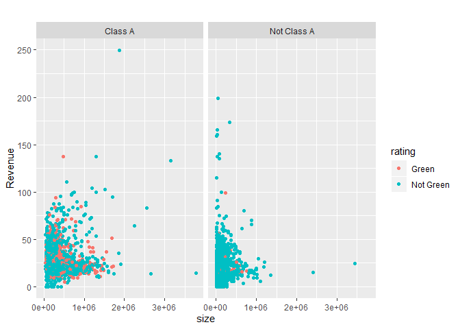
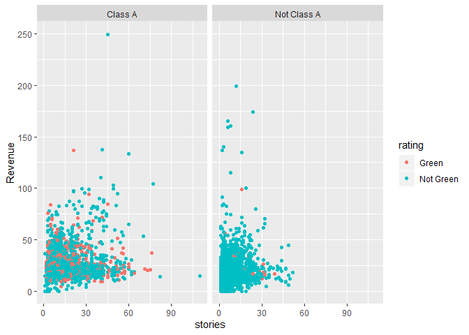
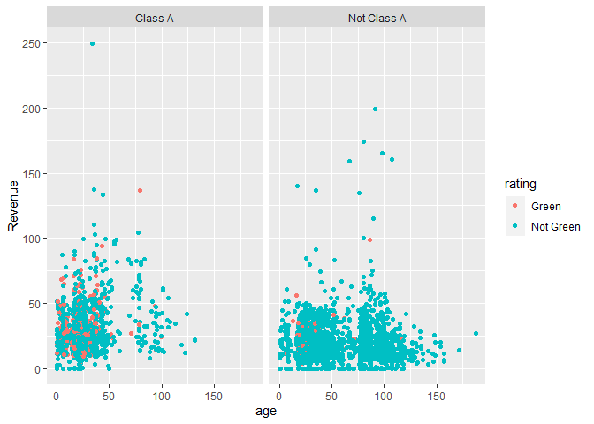
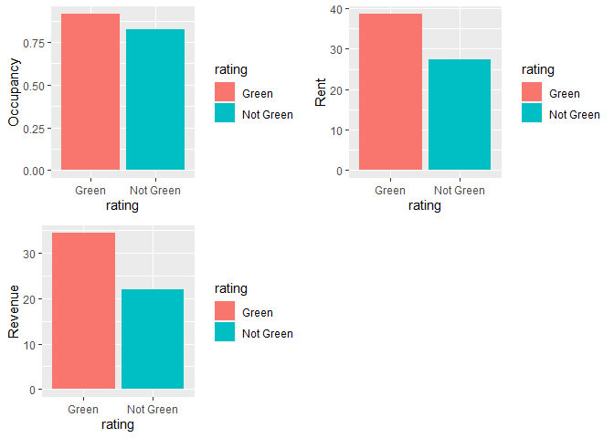
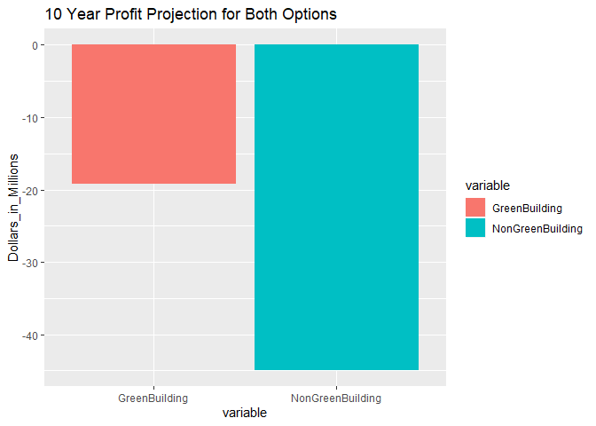
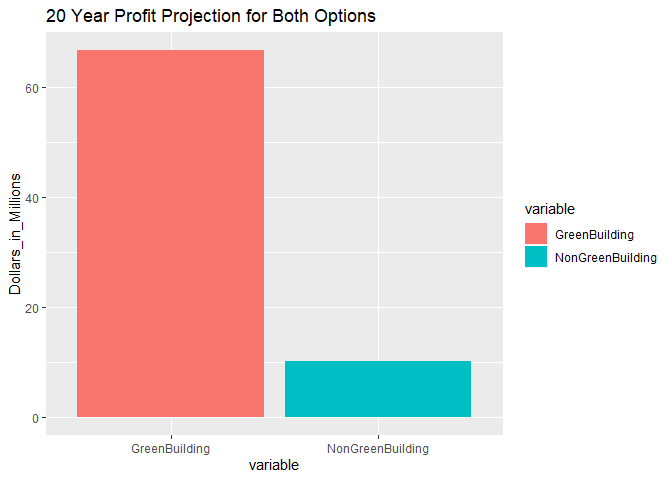
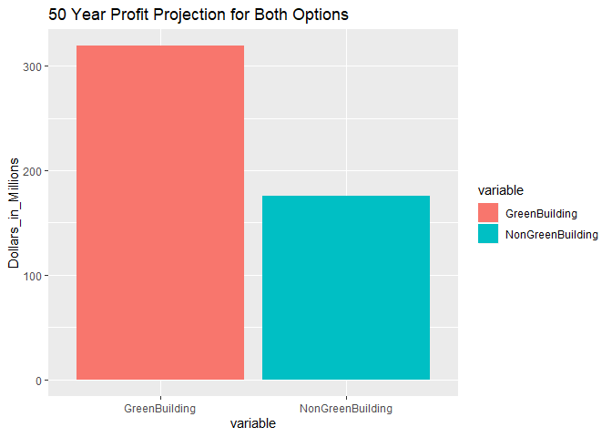

Hypothesis:
-----------

#### We believe that our client should invest in a green building because they will be more profitable

We start with basic exploratory data analysis to get a better
understanding of some of the relationships between our variables.

We also created a variable called revenue that is the product of leasing
rate and rent.

``` r
library(ggplot2)
ggplot(data = green)+
  geom_point(mapping = aes(x=size, y=Revenue, color=rating))+
  facet_wrap(~ class) + ggtitle('')
```



``` r
ggplot(data = green)+
  geom_point(mapping = aes(x=stories, y=Revenue, color=rating))+
  facet_wrap(~ class)
```



``` r
ggplot(data = green)+
  geom_point(mapping = aes(x=age, y=Revenue, color=rating))+
  facet_wrap(~ class)
```



#### In the above graphs there is no signicant evidence that supports our hypothesis. So we changed our hypothesis that green buildings are more profitable in specific subsets of buildings. So we narrowed our data to better mirror the building our client is considering to show that green is more profitable.

We choose a size range of 250,000 +- 25,000, a story range of 15 +- 1,
and only look at class A buildings under 20 years old. We then looked at
the median rent, leasing\_rate and revenue for our subset to check our
hypothesis.

We can clearly see that in this subset of buildings, green will generate
more revenue.

``` r
library(dplyr)
```

    ## 
    ## Attaching package: 'dplyr'

    ## The following objects are masked from 'package:stats':
    ## 
    ##     filter, lag

    ## The following objects are masked from 'package:base':
    ## 
    ##     intersect, setdiff, setequal, union

``` r
green123 = green %>%
  filter(size >= 225000) %>%
  filter(size <= 275000) %>%
  filter(stories > 13) %>%
  filter(stories < 17) %>%
  filter(age <20) %>%
  filter(class == 'Class A') %>%
  group_by(rating) %>%
  summarize(Rent = median(Rent, na.rm=TRUE),
            Occupancy = median(leasing_rate, na.rm=TRUE),
            Revenue = median(Revenue, na.rm=TRUE))


rent = ggplot(green123) + 
  geom_bar(mapping = aes(x=rating, y=Rent, fill=rating), stat='identity') 

ocup = ggplot(green123) + 
  geom_bar(mapping = aes(x=rating, y=Occupancy, fill=rating), stat='identity')

rev = ggplot(green123) + 
  geom_bar(mapping = aes(x=rating, y=Revenue, fill=rating), stat='identity')

library(gridExtra)
```

    ## 
    ## Attaching package: 'gridExtra'

    ## The following object is masked from 'package:dplyr':
    ## 
    ##     combine

``` r
grid.arrange(ocup, rent, rev, ncol=2, nrow=2, as.table=TRUE)
```



### Green buildings seem like the best investment, but we wanted to project total income differences at different time horizons to drive home the point that green buildings are in fact better investments. We looked at 10, 20 and 50 year time horizons and compared the revenue differences between green and nongreen.

``` r
library(tidyr)
total_green2 = ((((34.31424*250000)*10))/1000000)-105

total_nongreen2 = (((22.04097*250000)*10)/1000000)-100
GreenBuilding = (total_green2)
NonGreenBuilding = (total_nongreen2)

df = data.frame(Years=c(20),NonGreenBuilding, GreenBuilding)

df1 = df %>% 
  select(Years, NonGreenBuilding, GreenBuilding) %>%
  gather(key='variable', value='Dollars_in_Millions', -Years)


ggplot(df1) + 
  geom_bar(mapping = aes(x=variable, y=Dollars_in_Millions, fill=variable), stat='identity') + ggtitle('10 Year Profit Projection for Both Options')
```



``` r
total_green = ((((34.31424*250000)*20))/1000000)-105

total_nongreen = (((22.04097*250000)*20)/1000000)-100
GreenBuilding = (total_green)
NonGreenBuilding = (total_nongreen)

df = data.frame(Years=c(20),NonGreenBuilding, GreenBuilding)

df1 = df %>% 
  select(Years, NonGreenBuilding, GreenBuilding) %>%
  gather(key='variable', value='Dollars_in_Millions', -Years)


ggplot(df1) + 
  geom_bar(mapping = aes(x=variable, y=Dollars_in_Millions, fill=variable), stat='identity') + ggtitle('20 Year Profit Projection for Both Options')
```



``` r
total_green = ((((34.31424*250000)*50)-5000000)/1000000)-105

total_nongreen = (((22.04097*250000)*50)/1000000)-100
GreenBuilding = (total_green)
NonGreenBuilding = (total_nongreen)

df = data.frame(Years=c(50),NonGreenBuilding, GreenBuilding)

df1 = df %>% 
  select(Years, NonGreenBuilding, GreenBuilding) %>%
  gather(key='variable', value='Dollars_in_Millions', -Years)


ggplot(df1) + 
  geom_bar(mapping = aes(x=variable, y=Dollars_in_Millions, fill=variable), stat='identity') + ggtitle('50 Year Profit Projection for Both Options')
```



In 50 years green buildings will generate about 150 million more revenue
compared to the same non green building. So, our client should invest in
a green building.
